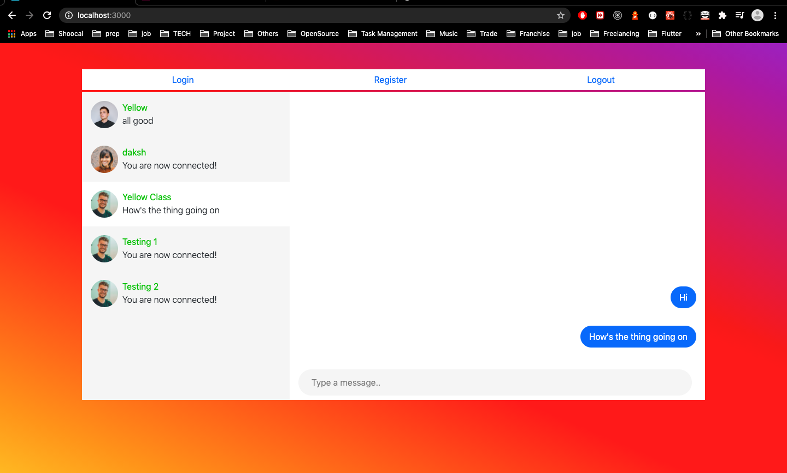
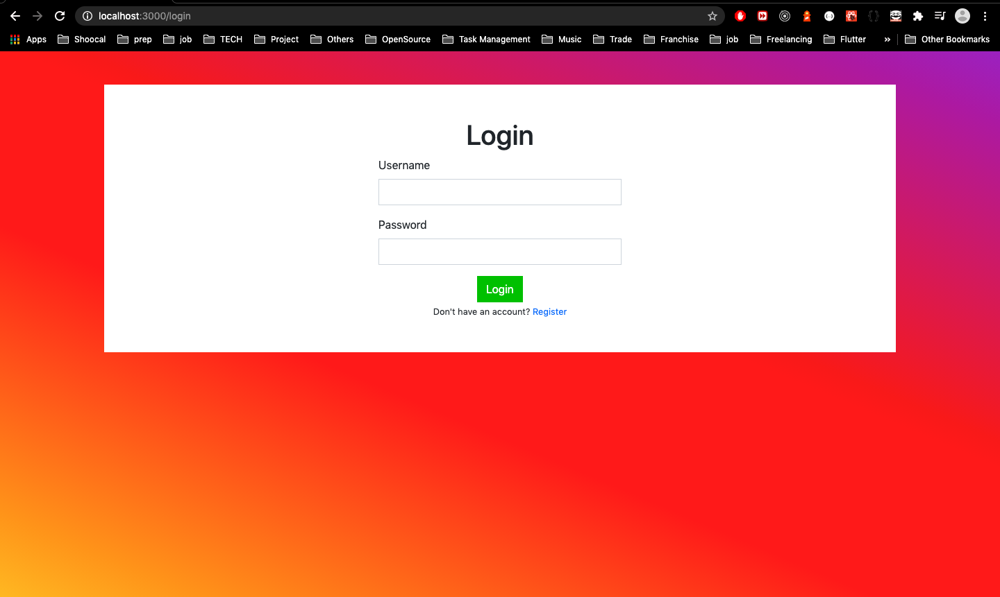
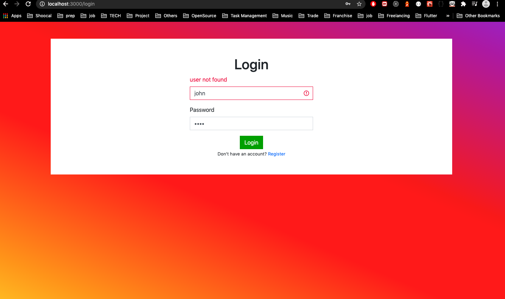
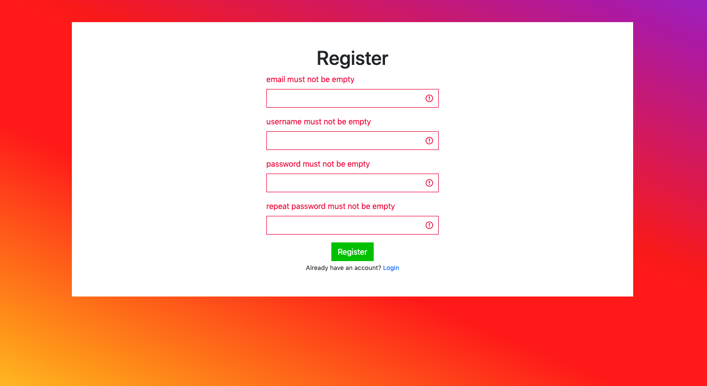
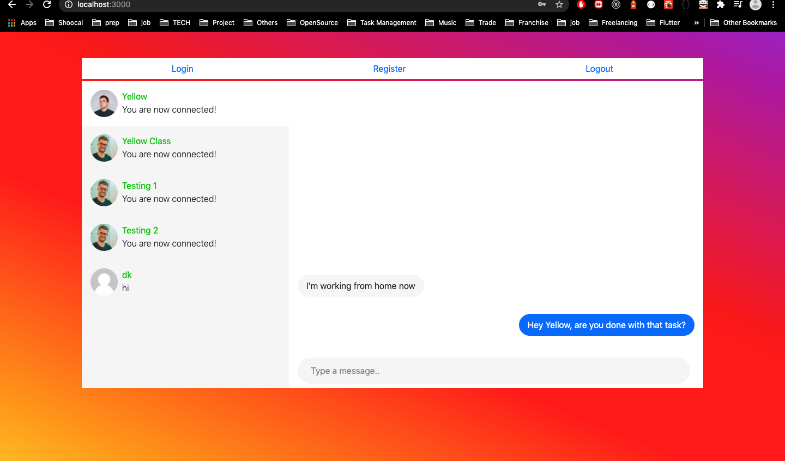

A realtime group chat application using Graphql and ES6 with JWT authentication.

The application currently uses mysql as database.
Sequelize js is used as Orm for the database.

For running the server.
Steps to Follow \
sequelize db:migrate   //to create all the tables along with the association between them \
sequelize db:seed:all // fill the data to the databse (not compulsory you can create also..) \
npm install (to install the packages) \
create a config folder and inside that create two files with name \
config.json => copy the contents from config.example.json file \
env.json => copy the contents from env.example.json file \

npm run dev // to run the application in development mode \

For running the client \
cd to the client folder \
run npm install \
npm start // to run the application \

